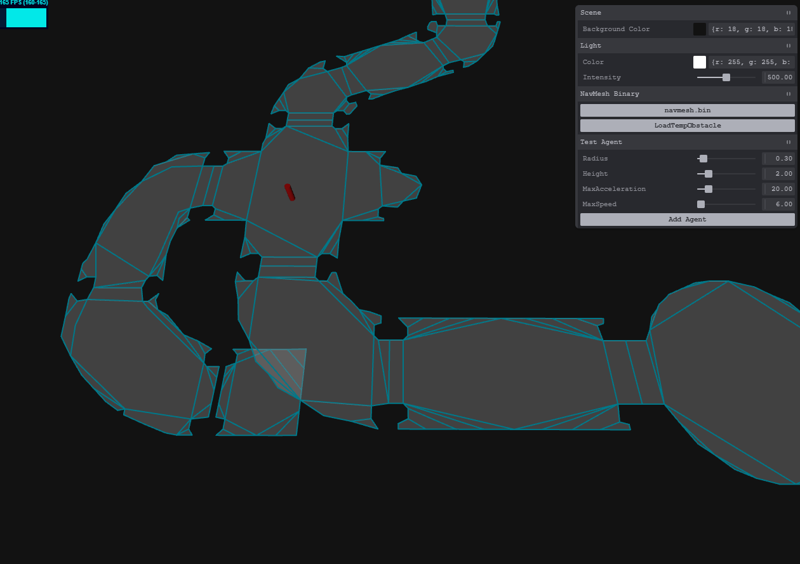

# detour-go: recast navigation(detour part) for go
## Features
- add DetourCrowd, converted from [recast navigation(c++ ver)](https://github.com/recastnavigation/recastnavigation/tree/main/DetourCrowd)
- add web debugger

## Installation
- install by go get
  ~~~shell
    go get github.com/o0olele/detour-go
  ~~~

## Usages
- load tile mesh binary data
  ~~~go
    var mesh = loader.LoadTileMesh("./navmesh.bin")
	if mesh == nil {
		panic("load mesh failed.")
	}
  ~~~
- init mesh query
  ~~~go
    var meshQuery = detour.DtAllocNavMeshQuery()
	var status = meshQuery.Init(mesh, 2048)
	if detour.DtStatusFailed(status) {
		panic("init mesh query failed.")
	}
  ~~~
- find nearest point on mesh
  ~~~go
    var agentPos [3]float32
	var agentHalfExtents = [3]float32{1, 0.75, 1}
	var agentNearestPoly detour.DtPolyRef
	status = meshQuery.FindNearestPoly(agentPos[:], agentHalfExtents[:], meshFilter, &agentNearestPoly, agentPos[:])
	if detour.DtStatusFailed(status) {
		panic("find closest point failed.")
	}
  ~~~
- find path
  ~~~go
    var path [256]detour.DtPolyRef
	var pathCount int
	meshQuery.FindPath(agentNearestPoly, agentNearestPoly, agentPos[:], agentTarget[:], meshFilter, path[:], &pathCount, 256)
  ~~~

- find straight path
  ~~~go
    var straightPath [256 * 3]float32
	var straightPathFlags [256]detour.DtStraightPathFlags
	var straightPathRef [256]detour.DtPolyRef
	var straightPathCount int
	meshQuery.FindStraightPath(agentPos[:], agentTarget[:], path[:], pathCount, straightPath[:], straightPathFlags[:], straightPathRef[:], &straightPathCount, 256, 0)
	fmt.Println(straightPath[:straightPathCount*3])
  ~~~
- see [examples/findpath](./examples/findpath/) for detail

## Debugger
- using web interface to view and debug navmesh

    

- usage

    ~~~shell
    cd ./examples/web
    go run main.go
    ~~~

- first click `LoadTileMesh` or `LoadTempObstacle` to upload mesh binary data.
- click `Add Agent` to init an agent.
- mouse right click to set agent position.
- mouse left click to set agent target position.

## Doc
- view [recast navigation](https://recastnav.com/) for detour use.